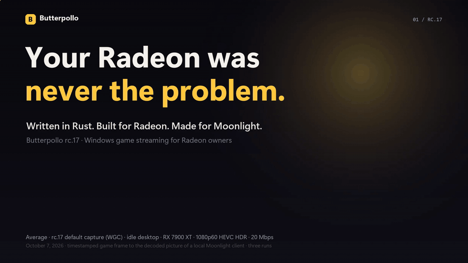

# Rubylight

**Written in Rust. Built for Radeon. Made for Moonlight.**

*Formerly Butterpollo. Existing installs update in place and keep their settings, paired devices and apps; links to the old GitHub address keep working.*

Stream your gaming PC to a laptop, TV or phone. Rubylight is a Windows game-streaming host with Radeon compute, native AMD encoding and **full 10-bit HDR 4:4:4 through PyroWave**. The host, native helpers, Windows service and installer are written in Rust.

**[Download rc.30](https://github.com/RamazanKara/Rubylight/releases/tag/2.0.0-rc.30)** · **[Get started](docs/getting-started.md)** · [Website](https://ramazankara.github.io/Rubylight/) · [Documentation](docs/README.md) · [Release notes](rust/RELEASE_NOTES.md)

Follow one frame from your game to Moonlight, see the dated Radeon measurements, then get started. 60 seconds · 1080p · 60 fps · original soundtrack. [Watch the film](docs/media/demo.mp4).

## The mission

AMD rarely gets any love in this space. The protocol started as NVIDIA's GameStream, and even after NVIDIA dropped GameStream in 2023, the hosts that replaced it kept NVIDIA first. Upstream Sunshine has had a native NVENC encoder since 2023, while AMD still goes through FFmpeg's generic AMF wrapper. AMD hasn't helped itself either. It shut down its own streaming app, AMD Link, in 2024, saying there are plenty of other ways to stream, and its drivers still have quirks like an RDNA4 freeze that hosts have to work around.

So Radeon owners have spent years hearing their cards are just worse at streaming. That is where Rubylight comes into play, and it is the sole reason Rubylight exists. Most of the time the card was never the problem. Nobody had sat down with it.

In practice that means a native AMF encoder instead of a generic wrapper, frame copies and colour conversion on Radeon compute queues, and someone reading AMD's driver release notes so you don't have to. When a driver freezes the stream, Rubylight works around it. When AMD fixes it, Rubylight removes the workaround and pretends nothing happened.

There are far better Sunshine forks, like [Vibepollo](https://github.com/Nonary/Vibepollo), for anything that is not AMD work. Rubylight's mission is to speed up development on AMD streaming, which has gotten no traction for years. Rubylight is not here to win a big userbase. There is no growth plan and no campaign to convert the NVIDIA crowd. As long as AMD users are happy, Rubylight is happy.

## Install. Pair Moonlight. Play.

1. Run **`rubylight-setup-2.0.0-rc.30.exe`** from the [release](https://github.com/RamazanKara/Rubylight/releases/tag/2.0.0-rc.30).
2. Open the Rubylight console at **`https://localhost:47990`** and create your local account.
3. Add your PC in Moonlight, enter its pairing PIN in **Devices**, then launch **Desktop**.

**WGC capture and Radeon compute are enabled by default.** Start at 1080p/60, then choose your resolution, frame rate and HDR. Upgrades carry your settings, paired devices and library forward. Updates notify you first, with automatic installation available as an opt-in.

[First-stream walkthrough, portable setup and migration →](docs/getting-started.md)

## Why Rubylight

Rubylight began as a fork of [Vibepollo](https://github.com/Nonary/Vibepollo), whose native AMF encoder came from the same author ([#342](https://github.com/Nonary/Vibepollo/pull/342)), and rebuilds the host in Rust around the Radeon frame path. Anything that works out here is GPL-3.0 for Vibepollo to take.

**On NVIDIA, use Vibepollo.** Rubylight includes NVENC, but it has not been tested on NVIDIA hardware.

| What you get | How it helps |
| --- | --- |
| **Radeon compute** | Frame copies and colour conversion run on D3D12 compute queues alongside the game's graphics work. Native AMF, or PyroWave, encodes the result. |
| **A Rust host throughout** | Streaming, protocol handling, native helpers, service and setup share the Rust implementation. |
| **HEVC and AV1 HDR** | Native capture and ten-bit BT.2020/PQ conversion preserve the HDR signal through encoding. H.264 is also available. |
| **PyroWave HDR 4:4:4** | Full-resolution colour keeps fine coloured text and edges crisp. |
| **A rebuilt web console** | Pair devices, manage your library and per-app settings, and see frame rate, bitrate and encoder timing together. |

Carried over from Vibepollo, Apollo and Sunshine and rebuilt in Rust: per-device virtual displays and display layouts, RTSS frame limits, application profiles, Steam and Playnite library sync, Lossless Scaling, and Nonary's 1000 Hz VRR mode, which needs [his Moonlight client](https://github.com/Nonary/moonlight-qt).

[How the frame pipeline works →](docs/architecture.md) · [Choose your settings →](docs/configuration.md)

## Measured on an RX 7900 XT

**Radeon compute cut average picture delay beside a game from 41.0 to 33.5 ms**, with the game holding 174 fps either way.

| 1080p60 HEVC HDR beside a game-like load | Compute off | Compute on |
| --- | ---: | ---: |
| Average render-to-decode delay | 41.0 ms | **33.5 ms** |
| 95th-percentile delay, averaged across runs | 54.4 ms | **42.3 ms** |
| Fresh pictures per second | 56.7 | **58.1** |
| Host time, present to send | 16.2 ms | **11.2 ms** |

Same Rubylight build, one setting changed · RX 7900 XT · DDX · 120 Hz virtual display · 20 Mbps requested · two runs per path · October 4, 2026. Render-to-decode measures picture age through independent loopback decoding. [Method and recorded runs](rust/PERFORMANCE.md#1080p-at-60-fps).

**Next to Vibepollo 2.0** in a matched setup, Rubylight rc.2 averaged 42.4 ms against 96.4 ms beside the same load and delivered 51.4 fresh pictures a second against 23.9. Most of that gap is not the compute path: with compute off, Rubylight still delivered about 57 fresh pictures a second in an earlier batch. Vibepollo handed its native AMF encoder about 24 frames a second, and the encoder logged that its output had not caught up. That encoder came from Rubylight's author; where the frames are lost is still being traced, and the fix goes to Vibepollo. [Matched comparison →](docs/performance.md#next-to-vibepollo-20)

**rc.17 against rc.2**, alternating on the same fixture on October 7: the same delay on the same capture path, and about 2 ms less beside the load with rc.17's default WGC capture (33.4 against 35.7 ms). [rc.17 against rc.2 →](docs/performance.md#rc17-against-rc2)

**New in rc.19:** beside a GPU-heavy game, PyroWave encodes a 1080p HDR 4:4:4 frame in 0.55 ms instead of 5.7 ms, now that its colour conversion runs on Radeon compute. When the encoder cannot keep up (5120×1440 HEVC at 240 fps), a game frame reaches the network in 11.1 ms instead of 42.7 ms, at the same 220 fps. [New in rc.19 →](docs/performance.md#new-in-rc19)

[Benchmarks, current WGC results and HDR validation →](docs/performance.md)

## Full colour with PyroWave

PyroWave carries **10-bit HDR with 4:4:4 chroma**: a colour sample for every pixel. Its GPU pipeline shares D3D11/Vulkan textures and sends the encoded stream over a fast wired LAN. Pair it with [Nonary's compatible Moonlight client](https://github.com/Nonary/moonlight-qt).

Standard Moonlight clients use H.264, HEVC or AV1. **Moonlight PC 6.2.0** has recorded codec and reconnect checks, including HEVC and AV1 HDR. [Pick the client and stream format for your setup](docs/getting-started.md#choose-your-stream-format).

## Find what you need

| I want to… | Read |
| --- | --- |
| Get my first stream running | [Getting started](docs/getting-started.md) |
| Set up displays, HDR, frame limits or updates | [Configuration](docs/configuration.md) |
| Diagnose pairing, capture, colour or smoothness | [Troubleshooting](docs/troubleshooting.md) |
| Understand the implementation and evidence | [Architecture](docs/architecture.md) · [Performance](docs/performance.md) · [Compatibility](rust/PARITY.md) |
| Build or integrate Rubylight | [Build guide](docs/building.md) · [Developer guide](rust/README.md) · [API reference](docs/api.md) |

Share your Radeon setup, games and results in [Issues](https://github.com/RamazanKara/Rubylight/issues). The [support guide](docs/troubleshooting.md) explains which logs and environment details make a report useful.

## Credits and license

Rubylight is **GPL-3.0**. Thanks to **Nonary** for Vibepollo, **ClassicOldSong** for Apollo, and **LizardByte and the Sunshine contributors**. The AMD encoder's low-latency defaults draw on **qiin2333's** work in AlkaidLab's Foundation Sunshine. PyroWave and Granite are by **Themaister** (MIT); the PyroWave Moonlight protocol and clients are **joemossjr16's** work.

[License](LICENSE) · [Third-party components](rust/THIRD_PARTY.md) · [Project history](docs/butterpollo-cpp.md)

The name came from a tester's verdict: **“smooth as butter.”**
