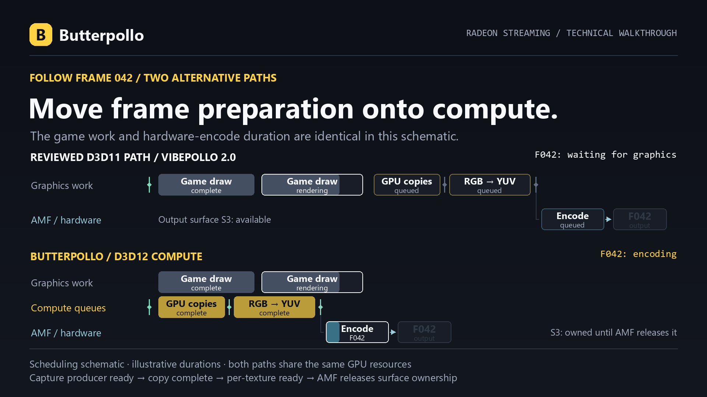

# How Butterpollo works

[Docs](README.md) · [Configuration](configuration.md) · [Performance](performance.md) · [Developer guide](../rust/README.md)

Butterpollo prepares frames beside the game's graphics work, passes GPU textures directly to native encoders and keeps ownership explicit until each consumer finishes. On Radeon, D3D12 compute is the key change in the standard video path.

## Written in Rust

The Windows host, Moonlight protocol implementation, native helpers, service and installer are written in Rust. The released executables do not link the old C++ host. The browser console uses Svelte; codec libraries, GPU SDKs and Windows drivers are external components.

| Component | Responsibility |
| --- | --- |
| [Core](../rust/core) | Pairing, encryption, RTSP/SDP, error correction, input parsing, permissions and durable state. |
| [Windows integration](../rust/windows) | Capture, colour conversion, native encoders, audio, input, displays, frame limiting and Windows service integration. |
| [Host](../rust/host) | HTTP/TLS, Moonlight endpoints, control and media transport, scheduling and session lifecycle. |
| [Setup](../rust/setup) | Installation, upgrades and package recovery. |
| [Web console](../rust/web) | Devices, games, settings, stream statistics, logs and maintenance. |
| [TrueHDR runtime](../rust/truehdr-runtime) and [Vulkan layer](../rust/vulkan-layer) | Native HDR integration for their supported paths. |

The earlier C++ host was removed after 2.0.0-rc.23; [that tag](https://github.com/RamazanKara/Butterpollo/tree/2.0.0-rc.23) keeps its sources. The [Rust build](building.md) uses the workspace at the repository root.

## The Radeon frame path

1. **Capture.** Automatic capture prefers Windows Graphics Capture (WGC), with Desktop Duplication available as an explicit choice and fallback.
2. **Copy and convert.** Shared GPU textures move through D3D12 compute queues for copies and RGB-to-YUV conversion on supported AMD GPUs.
3. **Encode.** Native AMD AMF consumes D3D12 surfaces and produces H.264, HEVC or AV1 bitstreams. The host claims a new picture only while fewer than two wait in the encoder, so an encoder that cannot keep up costs frames per second, not picture age.
4. **Deliver.** The host encrypts and packetizes the stream for Moonlight. Bounded queues keep retained work controlled.

The reviewed Sunshine-derived D3D11 path and Butterpollo both use GPU textures and native AMF. Butterpollo changes where frame preparation runs: compute work can overlap graphics work instead of joining the same graphics queue. The diagram illustrates scheduling; [measured timings](performance.md) come from separate fixtures. The reviewed baseline is Vibepollo 2.0.

Compute and graphics still share GPU resources. Copy/conversion efficiency helps the host's part of the frame journey; game rendering and desktop composition also determine when a fresh picture exists. [The saturation investigation](../rust/PERFORMANCE.md#saturation-diagnosis-and-queue-drain-rejection) records that distinction.

## Synchronization and ownership

A captured texture can arrive before its producer has finished writing it. Butterpollo waits for producer readiness on the GPU, copies it into an owned texture and holds the captured frame until that copy is safe. Each converted output texture has its own fence, so AMF's completion signal cannot release a different frame early.

Texture pools and native encoder queues are bounded. Texture ownership and per-frame HDR metadata survive until native codec references release them. Capture textures that cannot be shared use the D3D11 fallback. The [compute implementation](../rust/windows/src/compute.rs) and [synchronization measurements](../rust/PERFORMANCE.md#october-4-capture-copies-and-conversion-beside-a-game) contain the details.

## WGC through the Windows service

The service starts a hidden capture worker as the signed-in user, giving WGC access to the user's Windows capture broker. Three shared GPU textures transfer frames to the host; a local pipe carries bounded metadata and checks the participating process identities. The worker belongs to the capture session and closes with it.

WGC startup failures select Desktop Duplication. The implementation also falls back for lock/UAC desktops and retries WGC on return to the normal desktop; secure-desktop transitions have their own [hardware validation status](../rust/PARITY.md#feature-by-feature).

WGC requests an explicit zero minimum update interval where Windows supports it. Guarded source-phase pacing waits briefly for a predicted fresh update when capture history is stable and faster than the stream target. Irregular or slower sources use ordinary pacing. [Capture settings](configuration.md) expose the diagnostic overrides.

## Native HDR and full-resolution colour

The native HDR path captures FP16 scRGB, resizes in linear light and converts to ten-bit BT.2020/PQ. Shader math preserves absolute ST.2084 luminance. Windows HDR detection distinguishes an active HDR output from wide-gamut SDR colour management. [Independent decoding and reference-pixel checks](performance.md#hdr-and-pyrowave-validation) verify the tested pixel path.

**PyroWave provides full 10-bit HDR 4:4:4** through its own shared D3D11/Vulkan path. A compute pass on the D3D12 compute queue that also prepares AMF's frames writes its planar textures, a shared fence orders that pass with the Vulkan import, and the encoded bitstream returns to the CPU. Full-resolution chroma gives each pixel its own colour samples. Use [Nonary's compatible Moonlight client](https://github.com/Nonary/moonlight-qt) and a fast wired LAN; [client selection](getting-started.md#choose-your-stream-format) explains the options.

## Encoding beyond Radeon

The code also includes native NVIDIA NVENC, Intel Quick Sync imports and software compatibility paths. Native NVENC supports capability-gated reference recovery and GPU-only CUDA interop for ten-bit 4:4:4; Quick Sync imports D3D11 frames. The published measurements focus on AMD hardware. [Compatibility](../rust/PARITY.md) records implemented paths and which ones have native hardware evidence.

## Recovery and updates

Display recovery journals host-owned changes and preserves later user changes. Virtual-display startup uses a short guard for unexpectedly reactivated displays, ending after startup or an observed competing layout change.

Updates notify first. The installed service verifies the official installer, waits for an idle host and upgrades with package recovery for copying or startup failures. See [configuration](configuration.md) for the update controls and [getting started](getting-started.md) for installation and migration.
